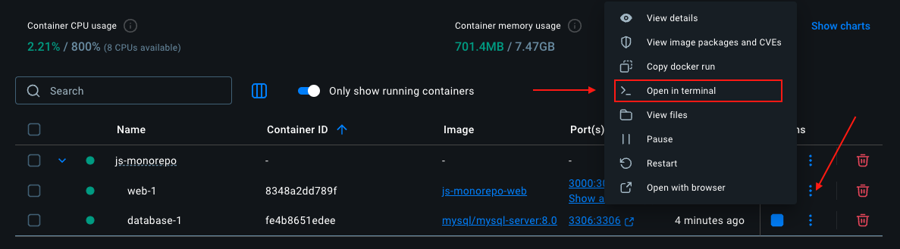

# Tes premiers pas avec Docker

Travailler avec Docker peut paraître difficile au premier abord. Comme le reste, c'est une compétence qui s'acquiert avec le temps et nous allons voir dans cet atelier les toutes premières marches à gravir pour découvrir ce formidable outil.

## Docker Desktop
1. Installe [Docker Desktop](https://www.docker.com/products/docker-desktop/) sur ta machine.
2. Lance la commande `docker --version` pour vérifier l’installation.  
Tu devrais obtenir quelque chose comme ça :
```bash
Docker version 28.0.4, build b8034c0
```

L'installation de Docker Desktop contient l'interface graphique qui permet de piloter Docker Engine également accessible depuis le terminal.
{: .alert-info :}

Nous allons commencer par utiliser Docker avec le terminal mais il te faut tout de même lancer l'application Docker Desktop pour démarrer Docker Engine.

## Voyage dans le temps
Commence par cloner ce dépôt grâce au lien donné à&nbsp;la&nbsp;section&nbsp;<a href="#input-clone"><i class="bi bi-code-slash"></i>&nbsp;Code ⬆</a>.  
{: .alert-info }

En consultant le fichier **README.md**, tu constateras que ce projet est un projet JavaScript construit avec les technos suivantes :
- **Node**, un environnement d'exécution JavaScript,
- **Gulp**, un outil d'automatisation de tâches,
- **node-sass**, un module qui compile le SCSS en CSS,
- **browser-sync**, un serveur de développement qui permet de recharger le navigateur à chaque modification de code.
Tu peux donc te dire que ce projet est un projet JavaScript classique et qu'il n'y a pas de raison que ça ne fonctionne pas sur ta machine.

Le premier réflexe est de lancer la commande `npm install` pour installer les dépendances et ensuite `npm run start` pour démarrer le serveur tel que décrit dans le fichier **README.md**.  

Lance-toi et exécute ces commandes dans le terminal en racine du projet.  

Tu devrais voir apparaître un **message d'erreur** ❌ indiquant que la version de **Node** installée sur ta machine est trop récente.

Il faut savoir que **node-sass** n'est pas compatible avec les versions de **Node** supérieures à `7`.  
Eh oui, tu as là une veille application de 2016 utilisant une version de **Node** qui n'est plus maintenue.
{: .alert-info }


Vas-tu installer cette vieille version de **Node** sur ta machine ? Non ! En tout cas, pas directement.  
En effet, tu trouveras en racine du projet un fichier **Dockerfile** qui contient les informations suffisantes pour que **Docker** puisse recréer un environnement de développement similaire à celui de 2016 mais totalement isolé de ta machine.

1. Démarre l'application **Docker Desktop** si ce n'est pas déjà fait. 
2. En racine du dossier, lance la commande suivante pour construire une image contenant une version de **Node 6** (version LTS de **Node** maintenue jusqu'en 2019).  
  ⚠️ N'oublie pas le point `.` il est important :
```bash
docker build -t vintage-frontend .
```
1. Lorsque la construction de l'image est terminée (cela peut prendre un peu de temps), demande à **Docker** de démarrer un conteneur à partir de cette image avec à la commande :
```bash
docker run -p 3000:3000 vintage-frontend
```
Grâce à cette commande, le port `3000` de ta machine a été relié au port `3000` du conteneur (le serveur **browser-sync**). Tu peux à présent te rendre avec ton navigateur à l'adresse [http://localhost:3000](http://localhost:3000) et constater que le projet fonctionne 🎉.

### Volume : persister les modifications
Tu travailles maintenant avec ce conteneur en **Node 6**. Seulement si tu modifies un des fichier de l'application (`index.html`, `app.js` ou `style.scss`) et que tu rafraîchis à nouveau ton navigateur, tu te rends compte que la modification n'est pas prise en compte 😥.
Il faudrait rejouer la première commande (pour reconstruire une image incluant ta modification) puis relancer le conteneur. Pas très pratique si tu dois faire ça sur un vrai projet 🥵.  
C'est là qu'intervient le concept de _volume_.

Éteins ton conteneur qui tournait via ton terminal avec les touches `ctrl + c` (3 fois) puis la commande :
```bash
docker stop $(docker ps -aq)
```
Pour info, cette commande arrête tous les conteneurs **Docker** actifs sur ta machine.
{: .alert-info }

Relance-le avec cette commande :
```bash
docker run -v ./src:/usr/src/app/src -p 3000:3000 vintage-frontend
```
L'option `-v` signifie _volume_ et indique à **Docker** de reporter toute modification effectuée dans le dossier `src` vers `:` le répertoire `/usr/src/app/src` à l'intérieur du conteneur.
Essaie de modifier le fichier _src/index.html_ ou _src/scss/style.scss_.  
Tu devrais voir que les modifications sont maintenant bien prises en compte et visibles à chaque rafraîchissement automatique du navigateur, on peut travailler ! 🥳

Retrouve toutes les commandes et options sur la [documentation de Docker Engine](https://docs.docker.com/engine/).

## Revenons au présent

{: .text-center }

Nous venons de voir que **Docker** s'avère très pratique mais que les commandes peuvent devenir assez lourdes avec toutes les options possible (volume, port, etc.). Et si on a besoin de plusieurs services (mysql, adminer, …) cela peut devenir très très lourd.

Et c'est là qu'intervient **Docker Compose**.

## Docker Compose
**Docker Compose** est aussi inclus avec **Docker Desktop**.  
Le concept est simple : réunir au sein d'un fichier `.yaml` tous les services nécessaires à un projet et les faire fonctionner ensemble tel que nous l'aurions fait avec une très longue commande `docker run [some options...]` dans le terminal.
Un exemple ? Ton projet 3 🤓.

Commence par couper le conteneur que tu as lancé précédemment avec la commande :
```bash
docker stop $(docker ps -aq)
```

Ensuite, tu vas te rendre dans le dossier de ton projet 3 et ouvrir le fichier `docker-compose.yml` pour y découvrir la configuration de l'environnement de développement.
Tu y trouveras la configuration de plusieurs services :
- **web** : le serveur de développement de ton projet fullstack,
- **database** : un service de base de données MySQL,


Ouvre un terminal en racine de ton projet 3 et lance la commande :
```bash
docker compose up -d
```
Tu te rends compte que la construction est un peu plus longue que tout à l'heure.

Cette commande va construire les images, installer les dépendances, démarrer les services et exécuter les commandes nécessaires à ton environnement de développement.

D’après le fichier `docker-compose.yml`, cela signifie :

- construire l’image pour ton projet fullstack,
- installer les dépendances avec `npm install`,
- lancer l'application (_client_ + _server_) avec `npm run dev`,
- démarrer une base de données **MySQL 8** configurée avec un script d’initialisation,
- exposer l’API sur [http://localhost:3310](http://localhost:3310) et l’interface React sur [http://localhost:3000](http://localhost:3000),
- relier automatiquement les ports et fichiers grâce aux volumes et aux variables d’environnement.

Tu peux maintenant te rendre sur [http://localhost:3000](http://localhost:3000) et constater que l'application fonctionne parfaitement 🎉.

Rendez-vous dans 10 ans pour voir si ça fonctionne toujours ! 😜

### 🛠 Besoin de taper des commandes dans le conteneur ?
**Docker Desktop** te permet d'ouvrir un terminal dans un conteneur en un clic.

Pour faire cela, regarde la fenêtre de **Docker Desktop** à l'onglet _Containers_, tu devrais voir apparaître ton projet dans la liste des conteneurs actifs, comme dans la capture ci-dessous, avec plusieurs options dont l'accès à un terminal.




### 🧹 Démonter les conteneurs et libérer l'espace
Lorsque tu as terminé ton travail, tu peux supprimer tes conteneurs Docker et libérer l'espace disque associé avec la commande :
```bash
docker compose down
```
Ton travail ne sera pas perdu pour autant car tu disposes toujours des fichiers source et il est possible de remonter un environnement à tout moment avec `docker compose up -d`.

# Conclusion
Configurer un environnement avec **Docker** nécessite des connaissances et de l'expérience. Dans une équipe, c'est souvent le rôle d'un DevOps ou d'un développeur expérimenté.  
Mais il est très facile, même pour un junior, de travailler dans un environnement **Docker** pré-configuré en utilisant de simples commandes.


Bienvenue à bord !
{: .text-center }

{: .text-center }